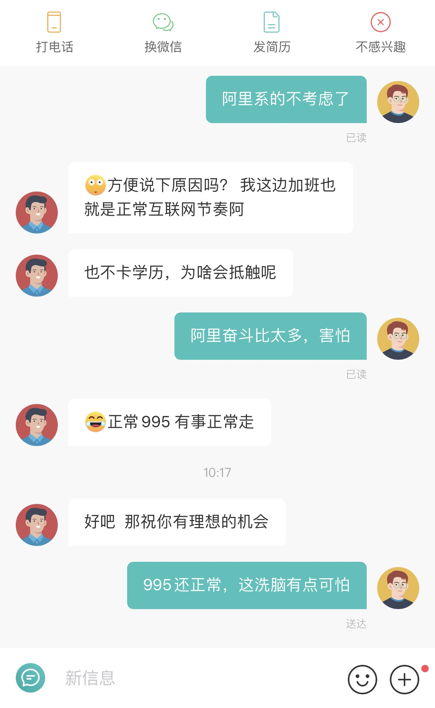

### 自我介绍

印记中文负责人，受不了公司周六日的无条件召唤，选择出来看看机会。

### 使用工具

招聘软件：以 Boss 直聘为例

### 详细描述

我是春节假期后 2021.02.22 开始找工作，拿到第一个 offer 的时间是今天 2021.03.01，一家没有生存压力的创业公司，工作时间是 10-7-5 这个强度。还有几家 9-6-5 的，例如外派到科研单位，或是外派到有政府背景的外企合资公司，社保公积金估计不是全额交，还需要面试后确认，这样的公司可以把工资提高作为备选。

在使用 Boss 直聘的过程中，也是有一些值得分享的经验：

1. 第一个经验（**重要**），不管是主动投递简历，或者是被动接受别人投递简历。如果别人跟你要简历，别直接发送简历，而是先聊几句，上来直接问清楚“你们的工作时间是什么样的”，说自己“希望找正常上下班的”，对方的人力资源会给你一个范围，比如“研发晚上 7, 8 点下班，周末不加班”，有些好的公司会说“工作日晚上加班有加班费、餐补、车补，周末可以调休，但一般不需要加班”。这种是可以继续聊下去的，如果对方直接说不清楚研发那边情况，那就后续问清楚研发人员，或者直接 pass。但是注意，态度一定要坚定，偶尔一两次是可以的，坚决不考虑长期加班，包括后续二面三面深入面谈时，也要把这个原则说清楚。**遇到一个很奇葩的阿里系的公司，他定义的互联网正常节奏是 9-9-5，具体看我的聊天图片吧**。
2. 第二个经验（**重要**），属于换工作后期不经意间发现的，直接以“早九晚六”为关键词进行筛选。因为 boss 到目前为止还没有开发筛选外企和公开提倡不加班的公司，这个词就像是对暗号一样的默契行为。希望招聘软件能够倡导不加班的正风气，提供更明确的引导，把那些尊重劳动者的公司筛选出来。
3. 第三个经验（一般），遇到公开宣传 996 的公司，直接在平台举报其违法行为，维护广大劳动者的根本利益。个人认为：资本家们可以偷偷摸摸搞 996，但人力资源敢在招聘平台公开宣传，那就必须见光死。谁公开提咱们就灭谁，这也是基本原则。
4. 第四个经验（一般），什么样的工作能够不加班呢？我们不妨反推一下。通过我这次换工作的询问考察，那些外企、外派到外企、国企、外派到国企，这些应该是最不用加班的，要么是倡导本身不加班，要么是外企不愿意触犯中国劳动法律，总之是公司没有太大生存压力的，也没有那么多伪需求。还有大公司创业团队出来单干的，
5. 第五个经验（一般），为什么国内的软件行业如此畸形呢？我也和很多朋友聊了聊。这里给出我的看法：
    1. 行业内部的生存压力。新晋公司通过牺牲自己的利润，例如本人所在的 to b 行业压低研发成本、客服成本，靠加班来压榨员工的剩余价值，然而却在销售方面增加支出，这种行业看清楚后千万不要去。不去从技术上突破创新，靠出卖员工的利益去讨好客户，属于没有底线的低级行为。这种商业模式一旦成型，后续也不会因为员工的抱怨和离职停止加班节奏，资本家脑子里面想的是补充新人替代旧人，然后继续剥削和压榨新人，这样周而复始下去。
    1. 部门领导的生存压力。老总不会养闲人，一年几百万雇佣中层，那就得拿点东西出来吧。大家看过教父就知道，受资本家一点小恩小惠，那可是要许多倍返还的，否则就会视为背叛，叛徒的下场就是必然受到严惩。
    1. 部门之间的斗争压力。在这种语境下，软件开发不再单纯，变成了资本家之间你死我活的政治斗争。看过大明王朝1566和万历十五年的就会应该知道，资本家们表面上光鲜的目的，背后往往掺杂着不可告人的私利。通过平台化等手段，把别的团队搞死搞残，借此在老总那里获得话语权，正本溯源后发现他们居然成天在搞这样的事情。百年前无数革命先烈抛头颅洒热血，为的就是劳动者能过上体面、本分的生活，有些资本家如果愿意做一个摇头摆尾、仗势欺人、招摇过市的恶犬，那请他们去做。更何况今天老总用这种方式对待其他部门，明天就反过来用这种方式对待你们部门，做人啊还是要学会善待他人，这种事我个人觉得最终只会害人害己。
    1. 不断制造出来的伪需求。产品经理为了上述 1,2 两条，强行挖掘需求、制造需求。其实这需求通常都是锦上添花，但研发是没有话语权的，无法拒绝。
    1. 高层方向错误，中层管理无能。加班的根本原因，在于中国研发成本低、违法成本低，资本家们进行胡乱试错。这些人天天讲成功学，其实就是瞎猫碰上死耗子。其实背后怎么成功的呢，是中层和基层不断试出来的。

### 正确评估风险

1. 外派注意不要是那种杂事很多的，不但要加班，还会很没尊严
2. 闲时吃紧，忙里偷闲。压力和强度降下来以后，还是要在技术领域投入，例如阅读开源源码，参与建设开源项目，这样也能在简历上添加些有价值的内容。千万别无所事事，而且注意给自己留条后路，万一哪天就业环境恶化了，咱们再回去 996（当然这种情况是杞人忧天，中国这么多软件公司， 国情复杂不可能各个都 996）。
3. 心态方面，不加班属于正常诉求，切不可觉得自己低人一等。工作时间和工作强度低了，工资可以降降，但不能无底线下降。工资可以在 70%-100% 之间浮动，建议保持平移。给大家简单算笔账，以每天 2 小时公共交通为例：9-9-5 工作制，14\*5=70h；9-9-6 工作制，14\*6=84h；而 10-7-5 工作制，11\*5=55h。

### 奇葩共赏
找工作遇到的奇葩，道不同不相为谋，咱就不想多评论了。

